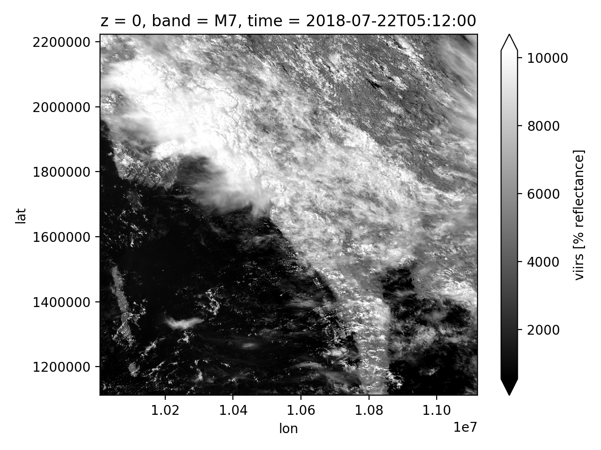
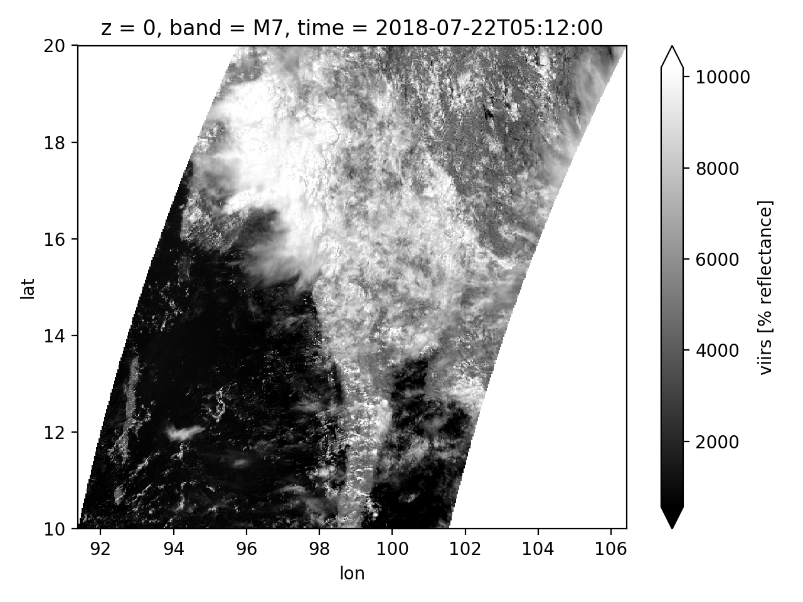
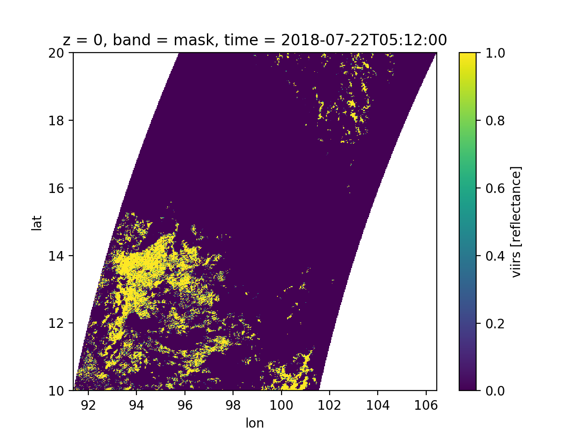
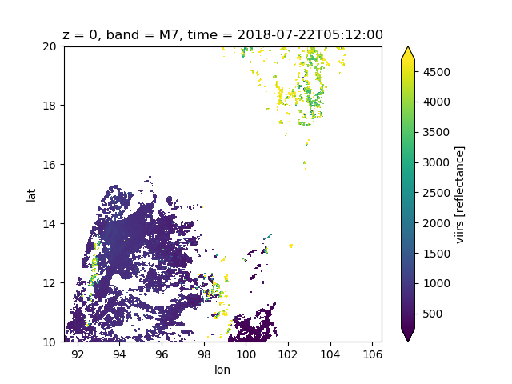
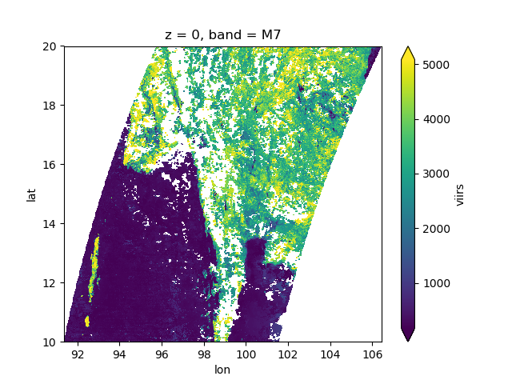

# RasterSmith
RasterSmith is a Python package aimed at making the analysis of satellite remote sensing data products easier.

### Installing RasterSmith
Currently, RasterSmith is under active development but is packaged and avialalbe to install via `pip`. To install the package, you can use pip  install for your Python environment:

```
pip install rastersmith
```

Or, you can install the package manually using the following commands<sup>1</sup>:

```
git clone https://github.com/kmarkert/rastersmith.git
cd rastersmith
pip install -e .
```

<sup>1</sup>Note: this method will only install the RasterSmith package in the current path. So, to use you will have to point the Python environment to this path to import. Or, you can install manually in the "site-packages" directory of your Python installation.

<!-- #### Dependencies -->


### Using RasterSmith
Here is a quick example of what you can do with RasterSmith. More detailed on the use of the package is provided in the [documentation](https://rastersmith.readthedocs.io/).

To begin, let's import rastersmith in an IPython environment.

```python
In [1]: import rastersmith as rs
```

The core strength of RasterSmith is the ability to read in geographic raster data and format it in a way that is internally consistent. For example, we will read in a [gridded VIIRS surface reflectance product](https://earthdata.nasa.gov/earth-observation-data/near-real-time/download-nrt-data/viirs-nrt) from NASA LANCE and explore the RasterSmith data structure.

```python
In [2]: viirs = rs.Viirs.read('VNP09GA_NRT.A2018247.h27v07.001.h5')

In [3]: viirs
Out[3]:
<xarray.DataArray 'viirs' (lat: 2400, lon: 2400, z: 1, band: 13, time: 1)>
array([[[[[8373],
          ...,
          [   0]]],


        ...,


        [[[3755],
          ...,
          [   0]]]]], dtype=int16)
Coordinates:
  * z        (z) int64 0
  * lat      (lat) float64 2.223e+06 2.223e+06 2.223e+06 2.222e+06 2.222e+06 ...
  * lon      (lon) float64 1.001e+07 1.001e+07 1.001e+07 1.001e+07 1.001e+07 ...
  * band     (band) <U4 'M1' 'M2' 'M3' 'M4' 'M5' 'M7' 'M8' 'M10' 'M11' 'I1' ...
  * time     (time) datetime64[ns] 2018-07-22T05:12:00
Attributes:
    nativeCrs:     {'init': 'epsg:6974'}
    projStr:       +proj=sinu +R=6371007.181 +nadgrids=@null +wktext
    bandNames:     ('M1', 'M2', 'M3', 'M4', 'M5', 'M7', 'M8', 'M10', 'M11', '...
    extent:        (91.388395, 10.0, 106.42665, 20.0)
    date:          2018-07-22 05:12:00
    units:         % reflectance
    scale_factor:  10000
    add_offset:    0
    resolution:    500
```

As we can see from the data structure, the  viirs variable is an xarray DataArray object with five dimensions which are labeled as `lat`, `lon`, `z`, `band`, and `time`. RasterSmith uses these five dimensions to account for the full dimensionality of all satellite data products (see [RasterSmith data structure](#rastersmith-data-structure) section for full details). Furthermore, we can see that there are coordinates associated with the labeled dimensions where we can use the internal xarray API for sub-sampling and manipulation. Lastly, we have common metadata properties provided as xarray attributes. For example, every satellite product has a projection String, or `projStr` (using the Proj4 sting representaion), to decribe the native coordinate system as well as extent, acquisition date, resolution, and scaling factors.

Now, let's view and explore the imagery. We will use the xarray selection and plotting API to display and view particular bands (using the labeled band dimension). Here we are selecting the Near-Infrared channel (`M7`) and plotting it with the geographic coordinates:

```python
# Select the moderate resolution NIR band from VIIRS and plot
In [4]: viirs.sel(band='M7').plot(robust=True,cmap='gray')
Out[4]: <matplotlib.collections.QuadMesh at 0x10ea66470>
```


From the resulting output we can see that the gridded VIIRS data was read in with the native sinusoidal projection (even though the coordinate labels lat/lon). **RasterSmith uses the WGS84 Geographic Coordinate System (EPSG: 4326) as the internal projection for comparing different raster datasets.**

For us now to use the VIIRS data within RasterSmith with other datasets, we must now reproject the data into the WGS84 projection. RasterSmith has a reprojection function to make it easier for users to change between coordinate systems:

```python
# Apply reprojection to VIIRS data
In [5]: viirsProj = rs.mapping.reproject(viirs,outEpsg='4326',outResolution=500)

# Plot the reprojected VIIRS data
In [6]: viirsProj.sel(band='M7').plot(robust=True,cmap='gray')
Out[6]: <matplotlib.collections.QuadMesh at 0xd2fd379b0>
```


We can now see that the actual VIIRS data is transformed to the WGS84 coordinate system and the coordinates along the Y and X axes are actual in latitude and longitude. Now, let's explore some more RasterSmith functionality for processing data.

Each xarray DataArray that RasterSmith creates has a `mask` band. This is a band that describes good data pixels (value of `1`) and poor data pixels to not use (value of `0`) based on internal satellite data product QA information. RasterSmith has a method to mask poor data within the object so any future operations will use only good data. First, let's explore what the mask looks like for this VIIRS dataset

```python
In [7]: viirsProj.sel(band='mask').plot()
Out[7]: <matplotlib.collections.QuadMesh at 0xd26f148d0>
```


Now let's look at how to apply the mask using the internal raster methods:

```python
In [8] viirsMasked = viirsProj.raster.applyMask()
# an equivalent syntax using xarray will be: viirsMasked = viirsproj.where(viirs.proj.sel(band='mask') == 1)

In [9] viirsMasked.sel(band='M7').plot(robust=True)
Out[9] <matplotlib.collections.QuadMesh at 0xd37e52198>
```


As we can see, when the mask is applied, all pixels in the `mask` band with a value of `0` will be given a `nan` value. This is beneficial when we want to start taking advantage of the multi-temporal acquisitions and make mosaics (using the `time` dimension).

Here is an example to create an 8-day mean composite from multiple image acquisitions. We will write a separate script to use the RasterSmith package to read in a preprocess multiple VIIRS datasets and create an 8-day composite. We will call this script 'viirsComposity.py'.

```python
import rastersmith as rs
import xarray as xr

# specify which files to read in and process
infiles = ['VNP09GA_NRT.A2018247.h27v07.001.h5',
           'VNP09GA_NRT.A2018248.h27v07.001.h5',
           'VNP09GA_NRT.A2018249.h27v07.001.h5',
           'VNP09GA_NRT.A2018250.h27v07.001.h5',
           'VNP09GA_NRT.A2018251.h27v07.001.h5',
           'VNP09GA_NRT.A2018252.h27v07.001.h5',
           'VNP09GA_NRT.A2018253.h27v07.001.h5',
           'VNP09GA_NRT.A2018254.h27v07.001.h5']

# read in the files using rastersmith
viirsDs = map(lambda x: rs.Viirs.read(x),infiles)

# apply the reprojection method to WGS84 for all rasters
viirsDsProj = map(lambda x: rs.mapping.reproject(x,outEpsg='4326',outResolution=500),viirsDs)

# apply the internal mask for all rasters
viirsDsMasked = map(lambda x: x.raster.applyMask(), viirsDsProj)

# merge all of the rasters into one DataArray by time dimension
viirsMerged = xr.concat(viirsDsMasked,dim='time')

# calculate the mean value for each pixel along the time dimension
viirsMosaic = viirsMerged.mean(dim='time')
```

Now let's run our script in our IPython session, time how long it takes to process, and view the results.

```python
In [10] %time %run viirsComposite.py
CPU times: user 1min 46s, sys: 16.3 s, total: 2min 2s
Wall time: 45 s

In [11] viirsMosaic.sel(band='M7').plot(robust=True)
Out[11] <matplotlib.collections.QuadMesh at 0xd1d7b2c88>
```


As we can see from benchmarking the processing, it takes about 45s to read and process the 8 VIIRS files and create a mean composite from all the data. We also see from the output of image that only clear (non-cloudy) pixels are being used to create the composite making, however, there are a few missing pixels still.

These examples are meant to highlight the use of RasterSmith for reading in, creating a consistent format, and preprocessing of satellite remote sensing products. For more information on the internal data structure and available functions within RasterSmith please see the [documentation](https://rastersmith.readthedocs.io/).

### Why RasterSmith?
Many satellite data products provided come in different (1) data formats, (2) number of bands, (3) spatial resolution/extent, and (4) geographic projections making the combined use of the data product often difficult to handle and use for non-experts. RasterSmith is used to take the differing data product and make a common format with a set of helper functions for use in analysis.

Take two commonly used remote sensing data products from [LandSat](https://landsat.usgs.gov/) and the [Visible Infrared Imaging Radiometer Suite](https://jointmission.gsfc.nasa.gov/viirs.html) (VIIRS). LandSat is distributed as GeoTIFF files, one file for each band, along with associated metadata in a separate file, where as VIIRS data is distributed as a single HDF5 file with embedded metadata. While individual LandSat GeoTIFF files can be easily used in GIS software, preprocessing is needed to use multiple bands together as a single variable. On the other hand, VIIRS data distributed as HDF5 data is difficult to read in and use within traditional GIS software. Ultimately, using the two datasets in conjunction with ArcGIS or QGIS has proven difficult due to the varying formats that the data is distributed in.

<!-- Furthermore, many satellite data products are provided to users as level-2 swath data (i.e. un-gridded data arrays) with varying levels of geographic information making the use of such data even more difficult to use within a GIS environment. For example, the [Advanced Technology Microwave Sounder](https://jointmission.gsfc.nasa.gov/atms.html) (ATMS) is provided by NOAA as swath data with -->

### RasterSmith data structure
RasterSmith is built upon the [xarray](http://xarray.pydata.org/en/stable/) package<sup>1</sup> and uses the already existing N-D labled array functionality from xarray to assist in harmonizing satellite data products. Thus, the satellite data products read in using RasterSmith adhere to the xarray philosophy with labeled dimensions.


<sup>1</sup> *Technically the core RasterSmith raster class is an [accessor](http://xarray.pydata.org/en/latest/generated/xarray.register_dataset_accessor.html#xarray.register_dataset_accessor) to the xarray DataArray class allowing access to the RasterSmith class methods directly from xarray objects.*
